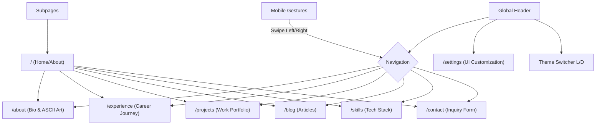

# Website Content & Flow

This document maps the user journey and navigation structure of the portfolio. It serves as a guide for both human developers and AI agents to understand the site's architecture.

## Site Flow Diagram

---

## Pages & Navigations

### 1. Main Entry Points
| Page | Route | Description |
| :--- | :--- | :--- |
| **Home / About** | `/` or `/about` | The primary landing page featuring high-impact ASCII art and professional summary. |
| **Experience** | `/experience` | A chronological timeline of professional roles and achievements. |
| **Projects** | `/projects` | Showcase of built applications with descriptions and links. |
| **Blog** | `/blog` | Collection of articles or write-ups. |
| **Skills** | `/skills` | Interactive display of technical competencies. |
| **Contact** | `/contact` | Interface for users to send messages or find social links. |

### 2. System Pages
| Page | Route | Description |
| :--- | :--- | :--- |
| **Settings** | `/settings` | Dashboard for toggling animations, performance modes, and sound (if applicable). |
| **Error (404)** | `/not-found`| Custom pixel-themed error page when a route is missing. |

### 3. Navigation Controls
- **Desktop Nav**: A classic top-aligned header with monospace links.
- **Mobile Nav**: Icon-based footer navigation for easy thumb access.
- **Swipe Navigation**: On mobile devices, users can swipe left/right to cycle through the primary sections.
- **Theme Toggle**: Quick access button in the header to switch between 'Light' and 'Dark' modes.
